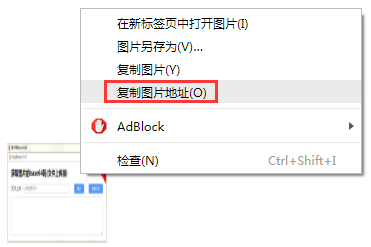

### 实现的功能：

本工具能获取图片的base64码，具体方式有两种：

1. #### 上传版

   打开`localhost:8464`，选中图片，然后点击提交按钮，成功后会将base64码直接发到文本域中，点击“复制代码”按钮，即可。

   

   &nbsp;

2. #### 粘贴版

   打开`localhost:8464/simple`，将截图或者网页上复制的图片直接粘贴到输入框中，在输入框下方即可出现一张新的图片（默认是缩略图，点击可放大为原尺寸），右键点击新的图片，选择“复制图片地址”，即完成base64码的复制。

   

   

   此外，粘贴版还有额外功能：

   - **可以切掉图片四周的圆角**（注意是切掉，而不是弄成白色），在左上、右上、右下、左下四个输入框中输入半径，点击“应用样式”按钮即可。这是针对windows对话框或者文件夹截图时四周的阴影而开发的；另外，为了查看切掉圆角的效果，所以可以切换背景。
   - **可以为图片添加边框**，只需设置颜色和宽度，其中前者可以是颜色名称、hex颜色、rgb颜色、hsl颜色，后者是边框宽度，注意不要带单位，最后点击“应用样式”按钮实现效果。

总结：**上传版适用于本地文件，粘贴版适用于截图或者复制网络图片，或者是PS中复制的图片。**

&nbsp;

### 使用方法：

将本项目clone到本地后，`npm install`安装依赖，在命令行工具中打开：

```
node app.js
```

服务器启动后，在浏览器中打开：

```
localhost:8464
```

即可使用。说明：8464是去base64的谐音。

补充，可用pm2进行进程管理，不需要次次启动服务。

```
pm2 start app.js --watch
```


